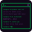

# > DEADDROP_ 
**Tor-native asynchronous micro-publishing for low-power nodes.**


DeadDrop is an experimental **Tor-native Nano-Pub node** built with PHP, SQLite, and static `outbox.json` syndication. It is designed for small VPS instances, Armbian boxes, and other low-resource machines where heavy federated stacks are impractical.

The project focuses on a simple idea: publish locally, expose a static feed, and let a background courier pull updates from trusted peers over Tor. The web UI is intentionally minimal and designed to remain usable in restrictive browser settings.

---

## ⚠️ Security Status

DeadDrop is a hobby/learning project and **has not been professionally audited**. Treat it as experimental software. Do not rely on it for life-critical, journalist-source-protection, dissident-safety, or high-risk operational security without an independent security review.

Current security posture:

- Uses Libsodium primitives for private-drop encryption experiments.
- Uses Tor hidden services for network reachability.
- Uses SQLite with local storage and optional off-webroot deployment.
- Uses server-side authentication, short-lived unlock sessions, and CSRF-guarded protected actions.
- Applies defensive limits against oversized remote `outbox.json` responses.
- Requires strict Tor v3 `.onion` peer validation by default.
- Exports a schema-versioned `outbox.json` for safer protocol evolution.
- Pins first-seen peer keys and pauses sync when peer keys change.
- Signs public outbox posts and verifies remote post signatures before insert.
- Supports peer moderation states, ping review, and per-peer remote-media drop policy.
- Provides a CLI-only health check for deployment verification.
- Supports age-encrypted backup export and CLI restore.

Important limitations:

- The “post-quantum” layer is currently a **placeholder/mockup**, not real ML-KEM/Kyber security.
- The project is **not zero-knowledge** in the formal cryptographic sense.
- Outgoing private drops may keep a local sender-side plaintext copy for usability, while the public outbox exports only the encrypted envelope.
- Metadata reduction and deletion features are best-effort, not a guarantee against forensic recovery on all storage media.
- Encrypted backups reduce accidental archive disclosure only when the age private key is kept off the live web server.
- Telegram bridge integration, if enabled, contacts Telegram’s infrastructure through Tor but still creates third-party metadata exposure.

Security notes, limitations, and safe wording guidance are included in this README.

---

## Architecture

DeadDrop uses a pull-based Nano-Pub model:

1. **Local publishing** writes posts into SQLite.
2. **Static export** rebuilds `outbox.json` for public syndication.
3. **Worker sync** periodically pulls peer `outbox.json` files over Tor.
4. **Radar** tracks peers, aliases, pinned keys, moderation status, and mutual status.
5. **Inbox** isolates private encrypted drops from the public timeline.

This avoids always-on push fanout. Visitors can fetch `outbox.json` or the public profile without forcing expensive real-time federation behavior.

---

## Features

### Nano-Pub Static Outbox
DeadDrop exports posts into a static `outbox.json`. Public reads are cheap and suitable for low-power hosts.

### Tor v3 Peer Policy
Production mode accepts only valid Tor v3 `.onion` peers by default. Localhost peers are disabled unless explicitly allowed for lab testing.

### Background Courier
`worker.php` pulls peer feeds through Tor SOCKS5 using concurrent cURL requests. Remote responses are capped to reduce memory-exhaustion risk.

### Private Drops
Private drops are encrypted as a Libsodium-based envelope using XChaCha20-Poly1305 for payload encryption and X25519 sealed boxes for key wrapping.

### PQ Placeholder Field
The `pq_public` / `pq_private` fields are reserved for future post-quantum work. Current “PQ” behavior is a structural placeholder and must not be described as real ML-KEM security.

### Private Media Lockdown
Private media attachments are disabled until encrypted-media support exists. Public media remains supported for public posts.

### Atomic Outbox Writes
`outbox.json` is written through a temporary file and `rename()` to reduce the chance of partial/corrupted feed exports.

### Off-Webroot Storage
Recommended deployments keep SQLite data, backups, and secrets outside `/var/www/html`.

### Short-Lived Unlock Sessions
Admin unlock state is stored server-side for a short period instead of carrying the master password in hidden form fields. Protected actions use the active unlock session and CSRF tokens instead of hidden password fields.

### Schema-Versioned Outbox
`outbox.json` exposes `schema_version`, `protocol_version`, node metadata, and capability flags. DeadDrop v11+ emits schema v2 and skips schema-less legacy feeds instead of trying to parse them.

### Peer Trust And Key Pinning
The worker pins a peer's first observed encryption key and signing key. If a peer later advertises changed keys, sync for that peer pauses and Radar displays `[ KEY CHANGED ]` until the operator approves or rejects the pending key.

### Signed Public Posts
Public posts exported through `outbox.json` are signed with a local Ed25519 signing key. The worker verifies remote public post signatures before processing tombstones or inserting posts.

### Peer Moderation
Radar can mark peers as `active`, `quarantined`, or `blocked`. Unknown pings are stored for review instead of being fed directly into worker sync. Blocked peers are rejected by `ping.php`.

### Remote Media Policy
Radar can set a per-peer remote media policy. When set to `drop`, the worker discards remote `media_url` values during insert while still allowing signed text posts from active peers.

### CLI Health Check
`health.php` is a terminal-only diagnostic script for checking PHP extensions, Tor SOCKS reachability, SQLite integrity, session storage, outbox schema, signed-post capability, peer-trust columns, moderation state, ping review state, and Nginx exposure rules.

### Age-Encrypted Backups
`offload.php` can export `.tar.gz.age` backup archives, and `restore-backup.php` provides a CLI-only restore path. Keep the age private identity offline or outside the webroot.

### Hashcash Knock Gate
`ping.php` can require a SHA-256 proof-of-work puzzle before accepting peer knocks. This is a throttling tool, not a full DDoS solution.

---

## Recommended Deployment Layout

```text
/var/www/html/deaddrop/      # public PHP app and static assets
/var/www/html/deaddrop/media # public media for public posts
/var/lib/deaddrop/           # private SQLite database
/var/backups/deaddrop/       # private rotating backups, preferably .tar.gz.age
/etc/deaddrop/config.php     # private node config/secrets
/run/deaddrop-sessions/      # tmpfs-backed PHP sessions, if available
```

The public webroot should not contain SQLite databases, backup archives, node secrets, or helper files intended only for inclusion by other PHP scripts.

---

## Live Server File Policy

A clean current production node should keep only runtime web files in `/var/www/html/deaddrop`. Helper scripts that are included by PHP may remain in the directory, but they must be blocked from direct browser access by Nginx.

### Keep in the live webroot

```text
/var/www/html/deaddrop/
├── assets/
├── auth.php      # internal auth/session helper; block direct web access
├── db.php        # bootstrap only; reads /etc/deaddrop/config.php; block direct web access
├── delete.php
├── dm.php
├── index.php
├── net.php       # internal network policy helper; block direct web access
├── health.php    # CLI diagnostics only; block direct web access
├── offload.php   # CLI/cron backup only; block direct web access
├── outbox.php    # internal outbox rebuild helper; block direct web access
├── ping.php
├── profile.php
├── publish.php
├── radar.php
├── restore-backup.php # CLI restore only; block direct web access
└── worker.php    # CLI/cron only; block direct web access
```

`outbox.json` is generated by the application and must remain publicly readable because it is the Nano-Pub feed. `media/` may remain public for public-post attachments.

### Keep outside the webroot

```text
/etc/deaddrop/config.php        # actual private config/secrets
/var/lib/deaddrop/deaddrop.sqlite
/var/backups/deaddrop/
/run/deaddrop-sessions/
```

The actual `config.php` should not live in `/var/www/html/deaddrop`. For an open-source repository, publish only `config.example.php`.

### Remove from live server after setup

```text
keygen.php
password-generator.php
migrate.sh
```

`keygen.php` and `password-generator.php` are init-only utilities. `migrate.sh` is only useful when migrating an older node; for a fresh reinstall it is not needed on the live server. If these files are kept in the repository, place them under a `scripts/` or `tools/` directory rather than deploying them to the live webroot.

### Documentation files

```text
README.md
CHANGELOG.md
```

These are useful for the source repository, but optional on STB/VPS live deployments. Security notes and claims mapping are kept inside this README to keep the repository simpler.

---


## System Dependencies

For Debian 12 / Armbian Bookworm with PHP 8.2:

```bash
sudo apt update
sudo apt install -y \
  nginx tor sqlite3 curl git nano ufw zram-tools util-linux age tar \
  php8.2-fpm php8.2-cli php8.2-sqlite3 php8.2-curl php8.2-mbstring php8.2-sodium
```

DeadDrop is documented for Debian 12 / Armbian Bookworm with PHP 8.2+. Older Debian releases are not the recommended path for current installs.

Notes:

- `util-linux` provides `flock`, used by cron examples to prevent overlapping worker/backup runs.
- `age` is required for encrypted backup export and restore.
- `tar` is used to package backup contents before encryption.
- `exiftool` is optional and only needed if your local deployment still uses metadata-stripping paths that call it.

---

## Nginx Configuration: Tor-Only + Current Hardening

DeadDrop is intended to be served through Tor, with Nginx bound only to localhost. The PHP application can still render public pages and `outbox.json`, but direct browser access to helper scripts, private storage, backup files, SQLite files, and dotfiles must be blocked.

Use this as the combined current server block:

```nginx
server {
    listen 127.0.0.1:80;
    server_tokens off;
    client_max_body_size 2M;

    server_name YOUR_ONION_ADDRESS.onion;

    root /var/www/html;
    index index.php index.html;

    # Disable directory listing globally.
    autoindex off;

    # Block include-only / CLI-only / secret-bearing PHP files.
    # This also blocks config.php as defense-in-depth for accidental webroot copies.
    # Keep this block before the generic PHP-FPM handler.
    location ~ ^/deaddrop/(auth|db|net|outbox|worker|offload|restore-backup|health|keygen|password-generator|config)\.php$ {
        return 403;
    }

    # Block private storage paths if old deployments still contain them.
    # New deployments should keep these outside /var/www/html entirely.
    location ^~ /deaddrop/data/ {
        return 403;
    }

    location ^~ /deaddrop/backup/ {
        return 403;
    }

    location ^~ /deaddrop/keys/ {
        return 403;
    }

    # Defense-in-depth: block accidental database, backup, env, log, and swap files.
    location ~* \.(sqlite|sqlite3|db|bak|backup|old|swp|env|ini|log)$ {
        return 403;
    }

    # Block hidden files and directories such as .git and .env.
    location ~ /\. {
        return 403;
    }

    # Normal public routing.
    location / {
        try_files $uri $uri/ =404;
    }

    # PHP-FPM handler.
    location ~ \.php$ {
        include snippets/fastcgi-php.conf;
        fastcgi_pass unix:/run/php/php8.2-fpm.sock;
    }
}
```

`outbox.json` must remain public because it is the Nano-Pub feed. The `media/` directory may remain public for public-post attachments. Private DM attachments are disabled until encrypted media support is implemented.

For production, keep SQLite, backups, and `/etc/deaddrop/config.php` outside the webroot; the Nginx blocks above are defense-in-depth for older installs or accidental file placement.


---

## PHP Session Storage on tmpfs

DeadDrop v11 uses short-lived server-side PHP sessions for the unlock flow. This prevents the master password from being carried through hidden form fields.

For low-power nodes and eMMC-based devices, session files should live in `/run` so they are stored on tmpfs instead of persistent storage.

```bash
sudo install -o www-data -g www-data -m 700 -d /run/deaddrop-sessions
echo 'd /run/deaddrop-sessions 0700 www-data www-data -' | sudo tee /etc/tmpfiles.d/deaddrop-sessions.conf
sudo systemd-tmpfiles --create /etc/tmpfiles.d/deaddrop-sessions.conf
```

`auth.php` automatically uses `/run/deaddrop-sessions` when the directory exists and is writable by `www-data`. If the directory is unavailable, PHP falls back to the default session path.

---

## Configuration Notes

Use a private config file outside the webroot:

```php
<?php
return [
    'node_name'   => 'YOUR_NODE_NAME',
    'node_url'    => 'http://your-v3-onion-address.onion/deaddrop',
    'admin_hash'  => 'YOUR_BCRYPT_ADMIN_HASH',
    'max_outbox'  => 50,
    'outbox_schema_version' => 2,

    'db_path'     => '/var/lib/deaddrop/deaddrop.sqlite',
    'backup_path' => '/var/backups/deaddrop',
    'backup_retention' => 7,
    'backup_include_config' => true,
    'backup_encryption' => true,
    'backup_age_recipient' => 'age1REPLACE_WITH_YOUR_PUBLIC_RECIPIENT',

    'session_ttl_seconds' => 900,

    'allow_local_peers' => false,

    'tg_on'       => false,
    'tg_token'    => '',
    'tg_chat'     => ''
];
```

For production, keep:

```php
'allow_local_peers' => false,
```

Only enable localhost peers in an isolated lab.

---

## Outbox Schema And Signing Policy

DeadDrop v11+ uses schema v2 as the minimum public feed format. DeadDrop v12 adds signed public posts and signing-key advertisement while keeping the schema boundary at v2:

```json
{
  "protocol": "Nano-Pub",
  "protocol_version": "12",
  "schema_version": 2,
  "node": {
    "name": "YOUR_NODE_NAME",
    "url": "http://your-v3-onion-address.onion/deaddrop",
    "public_key": "...",
    "pq_public": null,
    "signing_public_key": "...",
    "capabilities": {
      "signed_posts": true
    }
  },
  "capabilities": {
    "signed_posts": true
  },
  "posts": [
    {
      "id": "local-post-id",
      "content": "public text",
      "post_signature_alg": "Ed25519",
      "post_signature": "base64..."
    }
  ]
}
```

Schema-less outboxes are treated as legacy and skipped by the worker. This keeps the parser simple while preserving an explicit version boundary for later features such as encrypted media and paranoid inbox mode.

The worker verifies remote public post signatures before processing tombstones or inserting posts. Unsigned or invalidly signed posts are skipped.

---

## Peer Trust And Moderation

DeadDrop v12 strengthens federation safety around peer identity and network intake.

### First-Seen Key Pinning

When the worker first sees a peer outbox, it pins the peer's encryption public key and signing public key in `following`.

If the same peer later advertises changed keys:

- worker sync for that peer pauses,
- Radar shows `[ KEY CHANGED ]`,
- pending key fingerprints are displayed,
- admin must approve or reject the pending key manually.

This prevents silent public-key replacement during background sync.

### Moderation States

Radar supports three peer states:

| State | Worker behavior | Ping behavior |
|---|---|---|
| `active` | included in worker sync | known pings enter trusted queue |
| `quarantined` | skipped by worker | pings stay quarantined for review |
| `blocked` | skipped by worker | rejected by `ping.php` |

Unknown pings are stored as `pending` so the operator can review them in Radar before locking, quarantining, blocking, or dismissing them.

### Remote Media Policy

Each peer can use one of two remote-media policies:

| Policy | Behavior |
|---|---|
| `allow` | worker may keep valid remote public `media_url` values |
| `drop` | worker discards remote `media_url` values during insert |

This is useful for reducing exposure to untrusted remote media while still allowing signed text posts from active peers.

---


## Encrypted Backup Setup

DeadDrop v11 can export encrypted backup archives using `age`. This turns the old plaintext rotating backup into an encrypted `.tar.gz.age` export handled by `offload.php`, with restore handled by `restore-backup.php`.

Install `age` on the node if it is not already installed:

```bash
sudo apt update
sudo apt install age -y
```

Generate the backup keypair on a trusted admin workstation, not on the public node when possible:

```bash
age-keygen -o deaddrop-backup.agekey
```

The command prints a public recipient beginning with `age1...`. Put only that public recipient in `/etc/deaddrop/config.php`:

```php
'backup_encryption' => true,
'backup_age_recipient' => 'age1REPLACE_WITH_YOUR_PUBLIC_RECIPIENT',
```

Keep `deaddrop-backup.agekey` private. Do not place the `AGE-SECRET-KEY-...` identity in `/var/www/html/deaddrop`, `/etc/deaddrop/config.php`, or the public repository.

Run an encrypted backup manually:

```bash
sudo -u www-data php /var/www/html/deaddrop/offload.php --no-jitter
```

Normal cron can omit `--no-jitter`. Use `flock` to prevent overlapping backup jobs:

```cron
0 0 * * * flock -n /tmp/deaddrop-offload.lock /usr/bin/php /var/www/html/deaddrop/offload.php >> /var/log/deaddrop/offload.log 2>&1
```

Expected output path:

```text
/var/backups/deaddrop/deaddrop_backup_YYYYmmdd_HHMMSS.tar.gz.age
```

Backups include SQLite, WAL/SHM sidecars when present, public media, `outbox.json`, a manifest, and optionally `/etc/deaddrop/config.php` when `backup_include_config` is enabled. The temporary plaintext tarball exists only during export/restore and is deleted afterward.

Restore is CLI-only. First test with `--dry-run` on a disposable machine or non-production environment:

```bash
sudo php /var/www/html/deaddrop/restore-backup.php \
  /var/backups/deaddrop/deaddrop_backup_YYYYmmdd_HHMMSS.tar.gz.age \
  /path/to/deaddrop-backup.agekey \
  --dry-run
```

For a real restore, stop runtime services first:

```bash
sudo systemctl stop nginx php8.2-fpm
```

Then restore with explicit confirmation:

```bash
sudo php /var/www/html/deaddrop/restore-backup.php \
  /var/backups/deaddrop/deaddrop_backup_YYYYmmdd_HHMMSS.tar.gz.age \
  /path/to/deaddrop-backup.agekey \
  --yes
```

Repair permissions and restart services:

```bash
sudo chown -R www-data:www-data /var/lib/deaddrop /var/www/html/deaddrop/media
sudo chown root:www-data /etc/deaddrop/config.php
sudo chmod 0640 /etc/deaddrop/config.php
sudo systemctl start php8.2-fpm nginx
```

`restore-backup.php` creates a local safety copy under `/var/backups/deaddrop/restore_safety_*` before overwriting live files. Keep the age identity/private key off the node whenever possible.

---

## Health Check

DeadDrop includes a CLI-only health check:

```bash
sudo -u www-data php /var/www/html/deaddrop/health.php
```

JSON output is available for automation:

```bash
sudo -u www-data php /var/www/html/deaddrop/health.php --json
```

Use the health check after installation, after Nginx changes, after moving storage paths, after enabling encrypted backups, and after upgrading peer-trust or moderation features.

---

## Private Drop Model

DeadDrop’s private-drop model is experimental and intentionally simple:

```text
plaintext -> optional padding -> XChaCha20-Poly1305 ciphertext
symmetric key -> X25519 sealed box
optional second wrap -> placeholder field, not real PQ security
```

Incoming private drops are stored as ciphertext and decrypted only when the vault is unlocked. Outgoing private drops may keep a local plaintext copy for the sender’s own view, while the public `outbox.json` export strips the plaintext and publishes only the encrypted envelope.

This is not a formal zero-knowledge system.

---

## Threat Model

DeadDrop attempts to reduce risk from:

- casual web crawling,
- accidental clearnet exposure when deployed behind Tor correctly,
- oversized peer feed memory abuse,
- public feed corruption during write interruptions,
- silent peer key replacement during background sync,
- unsigned or invalidly signed public feed posts,
- unreviewed unknown pings entering worker sync automatically,
- unwanted remote media URLs from selected peers,
- accidental private-media leakage in `outbox.json`,
- accidental backup disclosure when encrypted backups are configured correctly,
- basic unauthorized admin access,
- low-grade ping flooding,
- common deployment mistakes detectable by the CLI health check.

DeadDrop does **not** currently protect against:

- a compromised host,
- malicious PHP extensions or OS-level malware,
- a stolen admin password,
- a stolen age private identity or backups decrypted on an unsafe host,
- browser compromise,
- traffic correlation by powerful adversaries,
- professional forensic recovery across all storage types,
- cryptographic attacks caused by unaudited protocol design,
- malicious peers that publish harmful public content,
- social graph discovery through operational mistakes,
- metadata exposure from optional third-party integrations.

---

## Development Philosophy

DeadDrop prefers:

- boring, local-first components,
- small PHP scripts over heavy services,
- static syndication over real-time push,
- explicit Tor routing,
- low memory use,
- deployability on cheap hardware,
- honest security language over theatrical certainty.

The aesthetic can stay cyberpunk. The security claims should stay precise.

---

## Security Notes And Claims Mapping

DeadDrop is experimental software and has not been independently audited. Use accurate language when describing it.

Prefer:

- “experimental”
- “best-effort hardening”
- “Libsodium-based private drop prototype”
- “Tor-native pull syndication”
- “post-quantum placeholder”
- “not audited”
- “not formal zero-knowledge”
- “age-encrypted backups”
- “schema-versioned outbox”
- “first-seen peer key pinning”
- “signed public posts”
- “operator-controlled peer moderation”
- “CLI deployment health check”

Avoid unless independently verified:

- “military-grade”
- “mathematically impervious”
- “absolute security”
- “zero clearnet leaks”
- “total immunity”
- “post-quantum secure”
- “zero-knowledge”
- “forensics-proof”

Security claims should be mapped like this:

| Old wording | Safer wording |
|---|---|
| Post-Quantum Armor | Post-quantum placeholder / reserved field |
| ML-KEM Kyber security | ML-KEM/Kyber is not implemented yet |
| Zero-Knowledge RAM Vault | Short-lived server-side unlock session and ciphertext-oriented inbox design |
| Plaintext is NEVER written | Incoming private drops are stored as ciphertext; outgoing local copies may retain plaintext for sender convenience |
| Total immunity against traffic analysis | Padding reduces simple size-based leakage but does not prevent traffic correlation |
| Absolute data vaporization | Best-effort deletion using SQLite secure_delete and file shredding where supported |
| Zero clearnet leaks | Tor routing is used for configured peer/Telegram requests, but deployment mistakes or integrations may still leak metadata |
| Military-grade | Uses standard Libsodium primitives in an unaudited application protocol |
| Mathematically impervious | Encrypted with modern primitives; protocol is not audited |
| Forensics-proof | Not forensics-proof, especially on flash storage, backups, snapshots, or compromised hosts |
| 0% JavaScript | Designed to work without JavaScript; verify no inline JS remains before claiming strict no-JS |
| Encrypted backups make the node safe if compromised | Encrypted backups reduce archive exposure when the age private key is kept off the live host |
| Health check proves the node is secure | Health check catches common deployment mistakes; it is not a security audit |
| Schema versioning prevents protocol attacks | Schema versioning improves migration safety, but does not authenticate peers |
| Short session means secrets cannot leak | Short server-side sessions reduce browser/form exposure but do not protect a compromised host |
| Key pinning proves the peer is legitimate | First-seen key pinning detects later key changes; the first key still depends on operator trust |
| Signed posts mean safe content | Signatures verify authorship/integrity, not whether content is safe or true |
| Blocked peers cannot affect the node at all | Blocked peers are rejected by DeadDrop policy, but network-level traffic can still reach Tor/Nginx |
| Remote media drop sanitizes posts | Remote media drop discards `media_url`; it does not sanitize post text or prove peer intent |

Production defaults should stay conservative:

```php
'allow_local_peers' => false,
'tg_on' => false,
'session_ttl_seconds' => 900,
'backup_include_config' => true,
'backup_encryption' => true,
'backup_age_recipient' => 'age1...'
```

Known limitations:

- The host OS, PHP runtime, web server, Tor daemon, and browser remain trusted components.
- A stolen master password compromises admin access and may decrypt local data.
- Encrypted backups do not help if the live host, master password, or age private identity is compromised.
- `health.php` catches common configuration mistakes but cannot prove the node is secure.
- Public posts and public media are intentionally public.
- Private media attachments are disabled until encrypted attachment support exists.
- First-seen key pinning is not a replacement for out-of-band key verification.
- Signed posts verify feed integrity only when the pinned signing key is trusted.

---

## Contributing

Issues, hardening patches, threat-model reviews, and documentation fixes are welcome.

Security-related contributions should clearly state:

- what risk is being reduced,
- what attack scenario is still out of scope,
- whether the patch changes the public `outbox.json` schema,
- whether it changes the schema v2+ compatibility boundary.

---

## Disclaimer

DeadDrop is experimental software. Use it at your own risk. Run it only if you understand the tradeoffs of operating a Tor hidden service, storing secrets on a server, and using unaudited cryptographic application code.
